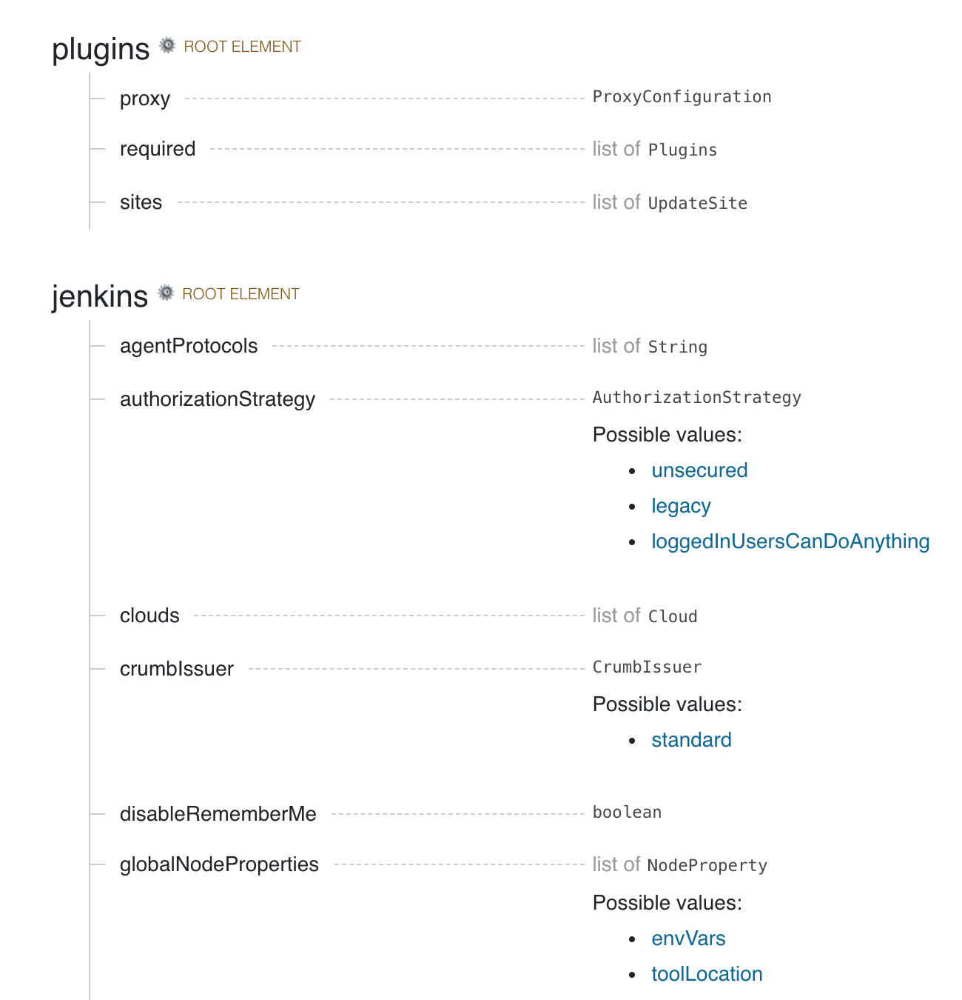
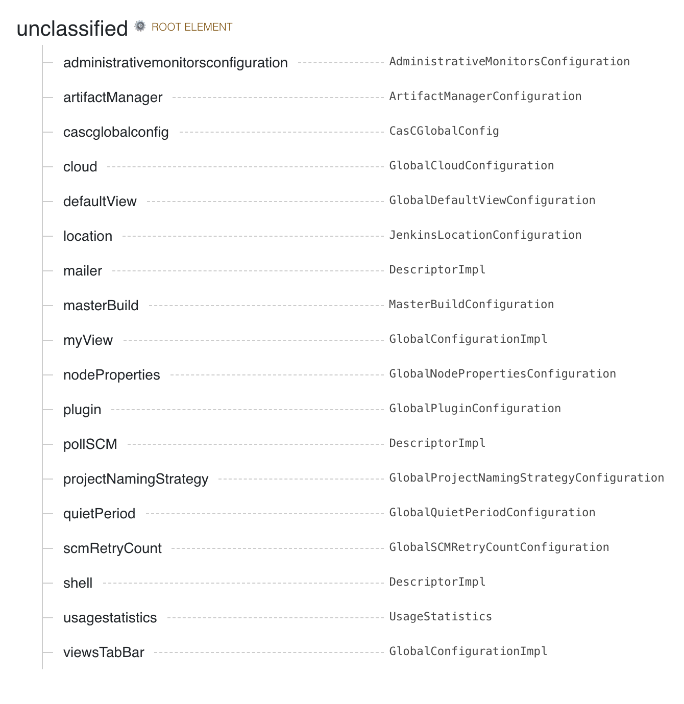
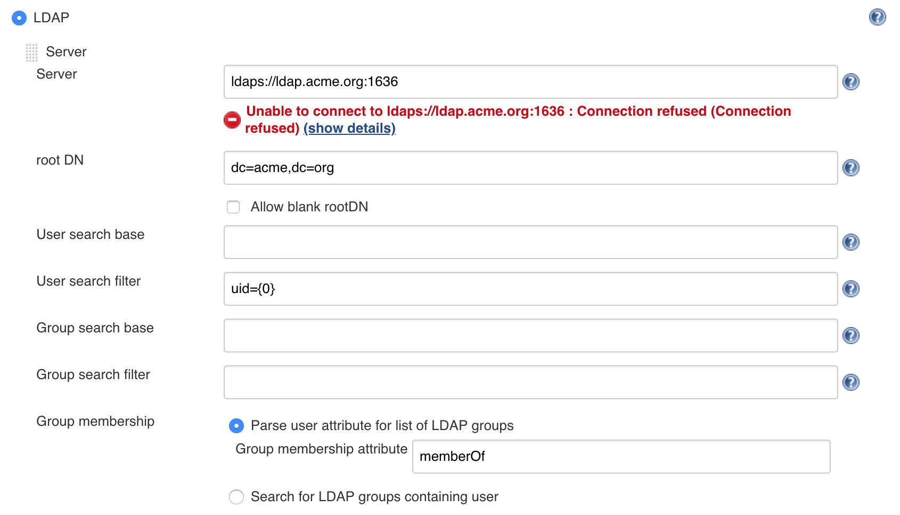

# Jenkins Configuration as Code (a.k.a. JCasC) Plugin

[](https://ci.jenkins.io/job/Plugins/job/configuration-as-code-plugin/job/master/)
[](https://travis-ci.org/jenkinsci/configuration-as-code-plugin)
[](https://github.com/jenkinsci/configuration-as-code-plugin/graphs/contributors)
[](https://www.codacy.com/app/casz/configuration-as-code-plugin)
[](https://plugins.jenkins.io/configuration-as-code)
[](https://github.com/jenkinsci/configuration-as-code-plugin/releases/latest)
[](https://plugins.jenkins.io/configuration-as-code)
[](https://gitter.im/jenkinsci/configuration-as-code-plugin)


## Introduction

Setting up Jenkins is a complex process, as both Jenkins and its plugins require some tuning and configuration,
with dozens of parameters to set within the web UI `manage` section.

Experienced Jenkins users rely on groovy init scripts to customize Jenkins and enforce desired state. Those
scripts directly invoke Jenkins API and as such can do everything (at your own risk). But they also require
you know Jenkins internals, and are confident in writing groovy scripts on top of Jenkins API.

The Configuration as Code plugin has been designed as an _**opinionated**_ way to configure Jenkins based on
human-readable declarative configuration files. Writing such a file should be feasible without being a Jenkins
expert, just translating into _code_ a configuration process one is used to executing in the web UI.

Below configuration file includes root entries for various components of your primary Jenkins installation. The `jenkins` one is for the root Jenkins object, and other ones are for various global configuration elements.

```yaml
jenkins:
  systemMessage: "Jenkins configured automatically by Jenkins Configuration as Code plugin\n\n"
  securityRealm:
    ldap:
      configurations:
        - groupMembershipStrategy:
            fromUserRecord:
              attributeName: "memberOf"
          inhibitInferRootDN: false
          rootDN: "dc=acme,dc=org"
          server: "ldaps://ldap.acme.org:1636"

  nodes:
    - permanent:
        name: "static-agent"
        remoteFS: "/home/jenkins"
        launcher:
          jnlp:
            workDirSettings:
              disabled: true
              failIfWorkDirIsMissing: false
              internalDir: "remoting"
              workDirPath: "/tmp"

  slaveAgentPort: 50000
  agentProtocols:
    - "jnlp2"

tool:
  git:
    installations:
      - name: git
        home: /usr/local/bin/git

credentials:
  system:
    domainCredentials:
      - credentials:
          - basicSSHUserPrivateKey:
              scope: SYSTEM
              id: ssh_with_passphrase_provided
              username: ssh_root
              passphrase: ${SSH_KEY_PASSWORD}
              description: "SSH passphrase with private key file. Private key provided"
              privateKeySource:
                directEntry:
                  privateKey: ${SSH_PRIVATE_KEY}
```

In addition, we want to have a well documented syntax file, and tooling to assist in writing and testing,
so end users have full guidance in using this tool set and do not have to search for examples on the Internet.

Also see the [presentation slides](https://docs.google.com/presentation/d/1VsvDuffinmxOjg0a7irhgJSRWpCzLg_Yskf7Fw7FpBg/edit?usp=sharing) from DevOps World - Jenkins World 2018 for overview.

## Getting Started

First, start a Jenkins instance with the [Configuration as Code](https://plugins.jenkins.io/configuration-as-code) plugin installed.

- Those running Jenkins as a [Docker](https://github.com/jenkinsci/docker) container (and maybe also [pre-installing plugins](https://github.com/jenkinsci/docker#preinstalling-plugins)), do include [Configuration as Code](https://plugins.jenkins.io/configuration-as-code) plugin.

Second, the plugin looks for the `CASC_JENKINS_CONFIG` environment variable. The variable can point to any of the following:

- Path to a folder containing a set of config files. For example, `/var/jenkins_home/casc_configs`.
- A full path to a single file. For example, `/var/jenkins_home/casc_configs/jenkins.yaml`.
- A URL pointing to a file served on the web. For example, `https://acme.org/jenkins.yaml`.

If `CASC_JENKINS_CONFIG` points to a folder, the plugin will recursively traverse the folder to find file (suffix with .yml,.yaml,.YAML,.YML), but doesn't contain hidden files or hidden subdirectories. It doesn't follow symbolic links.

If you do not set the `CASC_JENKINS_CONFIG` environment variable, the plugin will
default to looking for a single config file in `$JENKINS_HOME/jenkins.yaml`.

If everything was setup correctly, you should now be able to browse the Configuration as Code page with `Manage Jenkins` -> `Configuration as Code`.

## Initial Configuration

When configuring the first Jenkins instance, browse the examples shown in the [demos](demos)
directory of this repository. If you have a plugin that does not have an example, consult the reference
help document. Click the `Documentation` link at the bottom of the Configuration as Code page.



If you want to configure a specific plugin, search the page for the name of the plugin. The page will
show you which root element belongs to the configuration. Most installed plugins belong under the `unclassified` root
element.



## Examples

### LDAP

Replacing user interface based configuration for LDAP with the text based configuration.



```yaml
jenkins:
  securityRealm:
    ldap:
      configurations:
        - groupMembershipStrategy:
            fromUserRecord:
              attributeName: "memberOf"
          inhibitInferRootDN: false
          rootDN: "dc=acme,dc=org"
          server: "ldaps://ldap.acme.org:1636"
```

Also see [demos](demos) folder with various samples.

## Documentation

<a name="handling-secrets"></a>

You can find more documentation about JCasC here:

- [Handling Secrets](./docs/features/secrets.adoc)
- [Exporting configurations](./docs/features/configExport.md)
- [Validating configurations](./docs/features/jsonSchema.md)
- [Triggering Configuration Reload](./docs/features/configurationReload.md)

The configuration file format depends on the version of jenkins-core and installed plugins.
Documentation is generated from a live instance, as well as a JSON schema you can use to validate configuration file
with your favourite YAML tools.

The JSON Schema documentation can be found [here](./docs/features/jsonSchema.md).

**TODO**: Provide a Dockerfile to generate documentation from specified jenkins-core release and plugins.

## Installing plugins

We don't support installing plugins with JCasC you need to use something else for this,

Dockers users can use:\
[https://github.com/jenkinsci/docker/#preinstalling-plugins](https://github.com/jenkinsci/docker/#preinstalling-plugins)

Kubernetes users:\
[https://github.com/helm/charts/tree/master/stable/jenkins](https://github.com/helm/charts/tree/master/stable/jenkins)

## Supported Plugins

Most plugins should be supported out-of-the-box, or maybe require some minimal changes. See this [dashboard](https://issues.jenkins.io/secure/Dashboard.jspa?selectPageId=18341) for known compatibility issues.

## Compatibility with Jenkins >= 2.199

Jenkins 2.199 introduced [a check to prevent saving global configuration before loading the configuration has occurred](https://github.com/jenkinsci/jenkins/pull/4171). Configurations As Code needs to apply global configuration before Jenkins loads jobs (so they can load and correctly reference any global state) and as such until [JENKINS-51856](https://issues.jenkins-ci.org/browse/JENKINS-51856) is implemented there exists a race condition where by Jenkins may fail to start when used with this plugin.

If you encounter the race condition Jenkins will fail to start with an exception message similar to the following:

```text
SEVERE	jenkins.InitReactorRunner$1#onTaskFailed: Failed ConfigurationAsCode.init
java.lang.IllegalStateException: An attempt to save the global configuration was made before it was loaded
```

If you encounter this you can tell the plugin to delay configuration for an amount of time to give Jenkins time to load the global configuration before the configuration is applied by the plugin.

To enable this set the `io.jenkins.plugins.casc.ConfigurationAsCode.initialDelay` system property to a number of milliseconds to delay the initialisation by.
The required value will be dependant on aspects of your system (cpu/disk) and configuration, and how it can be found is mostly a trial and error.
A suggestion would be to start with 5000 (5 Seconds) and then increment by 2000 (2 seconds) until you no longer exhibit the issue and finally add 1000 (1 second) for some extra safety.
For example, to delay the configuration by 9 seconds you would use something like the following command `java -Dio.jenkins.plugins.casc.ConfigurationAsCode.initialDelay=9000 -jar jenkins.war`.
Exactly how and where you specify this option depends on the installation method used to install Jenkins.


## Configuration-as-Code extension plugins

- [configuration-as-code-groovy-plugin](https://github.com/jenkinsci/configuration-as-code-groovy-plugin)\
  Allows to specify groovy code that should run on during configuration.
- [configuration-as-code-secret-ssm-plugin](https://github.com/jenkinsci/configuration-as-code-secret-ssm-plugin)\
  Allows to resolve secrets from AWS' SSM secrets
- [hashicorp-vault-plugin](https://github.com/jenkinsci/hashicorp-vault-plugin)\
  Allows to resolve secrets from Hashicorp vault


## Jenkins Enhancement Proposal

As configuration as code is demonstrated to be a highly requested topic in Jenkins community, we have published
[JEP 201](https://github.com/jenkinsci/jep/tree/master/jep/201) as proposal to make this a standard component
of the Jenkins project. The proposal was accepted. :tada:
